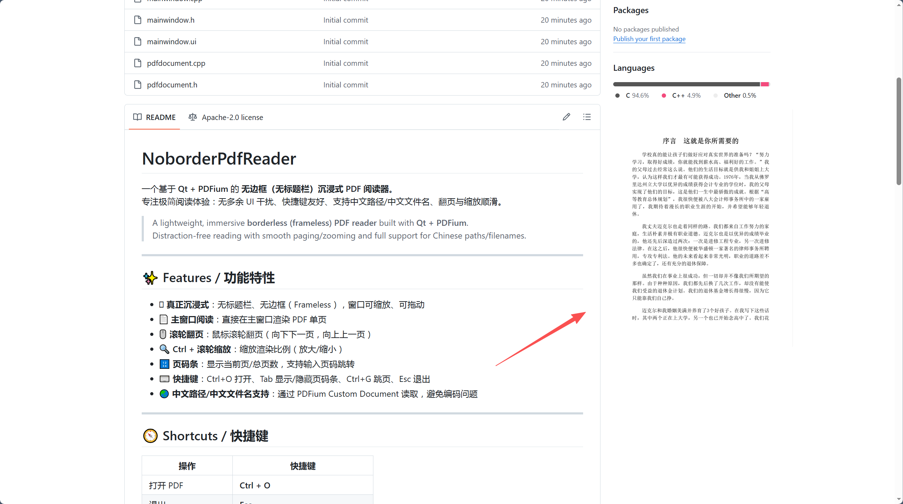

# 无边框pdf阅读器


一个基于 **Qt + PDFium** 的 **无边框PDF 阅读器**。 (无边框效果参考图片)

> A lightweight, immersive **borderless (frameless) PDF reader** built with **Qt + PDFium**.  
> Distraction-free reading with smooth paging/zooming and full support for Chinese paths/filenames.

---

## ✨ Features / 功能特性

- 🪟 **真正沉浸式**：无标题栏、无边框（Frameless），窗口可缩放、可拖动  
- 📄 **主窗口阅读**：直接在主窗口渲染 PDF 单页
- 🖱 **滚轮翻页**：鼠标滚轮翻页（向下下一页，向上上一页）
- 🔍 **Ctrl + 滚轮缩放**：缩放渲染比例（放大/缩小）
- 🔢 **页码条**：显示当前页/总页数，支持输入页码跳转
- ⌨️ **快捷键**：Ctrl+O 打开、Tab 显示/隐藏页码条、Ctrl+G 跳页、Esc 退出
- 🌏 **中文路径/中文文件名支持**：通过 PDFium Custom Document 读取，避免编码问题

---

## 🧭 Shortcuts / 快捷键

| 操作               | 快捷键                          |
| ------------------ | ------------------------------- |
| 打开 PDF           | **Ctrl + O**                    |
| 退出               | **Esc**                         |
| 下一页             | → / PageDown / ↓ / 鼠标滚轮向下 |
| 上一页             | ← / PageUp / ↑ / 鼠标滚轮向上   |
| 缩放               | **Ctrl + 鼠标滚轮**             |
| 显示/隐藏页码条    | **Tab**                         |
| 跳页（聚焦输入框） | **Ctrl + G**                    |
| 输入页码后跳转     | 在输入框按 **Enter**            |

---

## 🖼 Screenshots / 截图

> 建议你在仓库里建一个 `docs/` 目录，把截图放进去，然后取消注释下面的图片链接。




---

## 🧱 Tech Stack / 技术栈

- **Qt**: Qt Widgets (Qt 5/6 均可，项目当前使用 Qt Creator + Qt Widgets)
- **PDF Renderer**: **PDFium**
- **Windows Frameless Resize/Drag**: `nativeEvent(WM_NCHITTEST)` 实现边缘缩放、顶部拖动

---

## ✅ Build / 编译运行（Windows）

### 1) 环境要求
- Windows 10/11
- Qt 5.x / Qt 6.x（推荐与你当前工程一致的版本）
- 编译器：MSVC 或 MinGW（与你 Qt Kit 一致）

### 2) 准备 PDFium
你需要提供（或自行编译得到）：
- `pdfium.dll`
- `pdfium.lib`（MSVC）
  - 或者 `libpdfium.a`（MinGW）

推荐放到项目目录例如：

third_party/pdfium/
 include/        (fpdfview.h 等)
 lib/            (pdfium.lib 或 libpdfium.a)
 bin/            (pdfium.dll)
 licenses/       (可选：PDFium 的许可证文件)

```
并在 `.pro` 中正确配置 include / lib / dll 拷贝。

> 注意：如果你已经在项目里集成好了 pdfium（能运行），这一步可以忽略。

### 3) Qt Creator 打开并构建
1. Qt Creator 打开 `NoborderPdfReader.pro`
2. 选择 Kit（MSVC/MinGW 与 pdfium 库一致）
3. 选择 **Release**
4. Build → Run

---

## 📦 Release / 打包发布（Windows）

> 便携版发布目录建议结构：
```

NoborderPdfReader_Portable/
 NoborderPdfReader.exe
 pdfium.dll
 (Qt dlls...)
 platforms/qwindows.dll

```
### 步骤
1. Qt Creator 切到 **Release** 编译生成 exe  
2. 新建发布目录，把 `exe + pdfium.dll` 放进去  
3. 在 Qt 命令行执行：

​```bat
windeployqt --release --compiler-runtime NoborderPdfReader.exe
```

1. 在“没有装 Qt 的电脑/虚拟机/Windows 沙盒”测试运行

------

## 🗂 Project Structure / 项目结构

示例结构：

```
NoborderPdfReader/
  NoborderPdfReader.pro
  main.cpp
  mainwindow.h / mainwindow.cpp
  pdfdocument.h / pdfdocument.cpp
  mainwindow.ui
  third_party/ (optional)
  README.md
  .gitignore
```